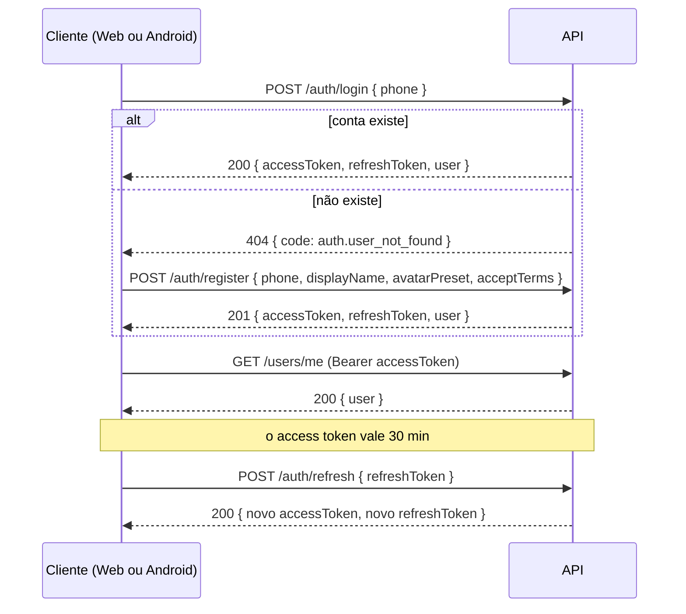

# API

REST + JSON em `/api/v1`, com tempo real por SignalR (em breve). O contrato completo e atualizado é o OpenAPI em
[`docs/openapi/v1.json`](openapi/v1.json); em desenvolvimento há uma interface interativa em `/scalar/v1`.

## Convenções

| Tema | Regra |
|---|---|
| **Versão** | prefixo `/api/v1`. Mudanças que quebram o contrato exigem `/api/v2`; campos novos são sempre opcionais (APKs antigos continuam em uso). `GET /api/v1/meta` informa `minClientVersion`: abaixo dela o app pede atualização. |
| **JSON** | `camelCase`; datas ISO-8601 em UTC; enums como texto `camelCase`; números estritos (`5` e não `"5"`). |
| **Autenticação** | `Authorization: Bearer <accessToken>`. Sem cookies. |
| **Erros** | `application/problem+json` (RFC 9457) com `code` **estável** (use-o para decidir o que fazer), `detail` em português para exibir, `traceId` para suporte e, em validações, `errors` por campo. Esquema `ApiProblem`. |
| **Limite de taxa** | `429` com `Retry-After` e `code: rate_limit.exceeded`. |
| **Rastreio** | toda resposta traz `X-Trace-Id`. |
| **CORS** | só origens configuradas (lista explícita). Para SignalR, o cliente deve usar `withCredentials: false` ou a origem precisa estar na lista. |
| **Cache** | respostas da API não são armazenadas (`no-store`); a imagem de uma foto de avatar é pública, imutável e cacheável por um ano (`ETag`, `immutable`). |

Exemplo de erro:

```json
{
  "type": "urn:ronat-ia:error:auth.user_not_found",
  "title": "Não encontrado",
  "status": 404,
  "detail": "Não existe conta com este telefone. Cadastre-se para continuar.",
  "code": "auth.user_not_found",
  "traceId": "4bf92f3577b34da6a3ce929d0e0e4736"
}
```

## Entrada (sem SMS e sem senha)

O telefone é só o identificador (ADR-0003). Não há verificação por mensagem.



- **Telefone:** aceito com ou sem código do país e com qualquer máscara (`(11) 98888-7777`, `+55 11 98888-7777`...). Padrão: Brasil.
- **Access token:** 30 min. Guarde em memória.
- **Refresh token:** 90 dias, **de uso único**: cada renovação devolve um novo e invalida o anterior. Guarde no armazenamento seguro do aparelho (Android: Keystore). Se a resposta da renovação se perder, repetir a chamada com o mesmo token funciona por 15 s; depois disso, reapresentar um token já trocado derruba a sessão (sinal de roubo).
- **Antes de renovar:** só use o token novo depois de recebê-lo; nunca dispare duas renovações ao mesmo tempo.
- **Várias sessões:** cada aparelho tem a sua (máx. 10). `GET /auth/sessions` lista, `DELETE /auth/sessions/{id}` desconecta um aparelho, `POST /auth/logout-all` desconecta todos.
- **Captcha:** quando `GET /api/v1/meta` informa `auth.captchaRequired: true`, mostre o widget do Cloudflare Turnstile (chave pública em `auth.captchaSiteKey`) e envie o token em `captchaToken` no login e no cadastro.
- **Cadastro fechado:** se `auth.registrationOpen` for `false`, o cadastro responde `403 auth.registration_closed`; quem já tem conta continua entrando.

## Perfil e avatar

Todo `user` devolvido pela API traz `avatar`: `{ "kind": "preset", "preset": "preset-3", "url": null }` (avatar pronto; as imagens
prontas vivem no Front, com o nome da chave) ou `{ "kind": "photo", "preset": null, "url": "/api/v1/avatars/<id>" }` (foto
enviada; prefixe `url` com a URL base da API). Sempre é um dos dois.

- **Avatares prontos:** `GET /avatars/presets` (público, usado na tela de cadastro) lista as chaves e o padrão.
- **Escolher um pronto ou mudar o nome:** `PATCH /users/me` com `{ displayName?, avatarPreset? }`; só o que for enviado muda. Escolher um pronto descarta a foto.
- **Enviar foto:** `PUT /users/me/avatar`, `multipart/form-data`, campo `file`. Aceita JPEG, PNG, WebP e GIF de até **3 MB**. O servidor **recorta em quadrado pelo centro, reduz para 256×256, reencoda em WebP e descarta todos os metadados** (inclusive a localização do GPS); a rotação do EXIF é respeitada. O original nunca é guardado. Limite: 20 envios por hora por pessoa. Enviar de novo substitui (e apaga) a foto anterior.
- **Remover a foto:** `DELETE /users/me/avatar` volta ao avatar padrão (idempotente).
- **Ver a foto:** `GET /avatars/{id}` é público (é um `` simples, sem token), não adivinhável e imutável: `Cache-Control: public, max-age=31536000, immutable`, com `ETag` (responde `304` a `If-None-Match`).
- **Excluir a conta:** `DELETE /users/me` com `{ "confirmation": "EXCLUIR" }` (LGPD). Anonimiza os dados, apaga a foto, encerra todas as sessões e **libera o telefone** para um novo cadastro. Não dá para desfazer.

## Endpoints atuais

| Método | Rota | Auth | Descrição |
|---|---|---|---|
| GET | `/api/v1/meta` | não | versão da API, versão mínima do cliente, hora do servidor, estado de cadastro/captcha |
| POST | `/api/v1/auth/login` | não | entra com o telefone; `404 auth.user_not_found` se não houver conta |
| POST | `/api/v1/auth/register` | não | cria a conta (telefone, nome, avatar pronto) e inicia a sessão |
| POST | `/api/v1/auth/refresh` | não | troca o refresh token por um novo par |
| POST | `/api/v1/auth/logout` | sim | encerra a sessão atual |
| POST | `/api/v1/auth/logout-all` | sim | encerra todas as sessões da conta |
| GET | `/api/v1/auth/sessions` | sim | aparelhos conectados (marca o atual) |
| DELETE | `/api/v1/auth/sessions/{id}` | sim | desconecta um aparelho |
| GET | `/api/v1/users/me` | sim | perfil da própria pessoa |
| PATCH | `/api/v1/users/me` | sim | muda o nome e/ou escolhe um avatar pronto |
| DELETE | `/api/v1/users/me` | sim | exclui a conta (exige a confirmação `EXCLUIR`) |
| PUT | `/api/v1/users/me/avatar` | sim | envia a foto do avatar (`multipart/form-data`, campo `file`) |
| DELETE | `/api/v1/users/me/avatar` | sim | remove a foto e volta ao avatar padrão |
| GET | `/api/v1/avatars/presets` | não | chaves dos avatares prontos |
| GET | `/api/v1/avatars/{id}` | não | imagem de uma foto (WebP 256×256, cacheável) |
| GET | `/health/live`, `/health/ready` | não | processo; processo + banco |

*Grupos, partidas, tempo real, ranking e histórico entram nas próximas fases.*

## Códigos de erro atuais

| Código | Status | Quando |
|---|---|---|
| `validation.failed` | 400 | corpo ou campos inválidos (veja `errors`) |
| `auth.invalid_phone` | 400 | telefone inválido |
| `auth.terms_not_accepted` | 400 | cadastro sem aceitar os termos |
| `auth.captcha_failed` | 400 | captcha ausente, inválido ou expirado (quando exigido) |
| `user.display_name_invalid` | 400 | nome fora das regras (2 a 30 caracteres, sem invisíveis) |
| `avatar.unknown_preset` | 400 | avatar pronto inexistente |
| `avatar.invalid_image` | 400 | o arquivo não é JPEG, PNG, WebP ou GIF válido (vazio, truncado, SVG, texto...) |
| `avatar.dimensions_too_large` | 400 | imagem com lado acima de 8000 px ou mais de 25 megapixels |
| `user.delete_not_confirmed` | 400 | exclusão de conta sem a confirmação `EXCLUIR` |
| `auth.unauthorized` | 401 | sem token, token inválido/expirado ou sessão encerrada |
| `auth.invalid_refresh_token` | 401 | refresh token inválido, expirado ou já trocado |
| `auth.forbidden` | 403 | sem permissão |
| `auth.account_suspended` | 403 | conta suspensa |
| `auth.registration_closed` | 403 | cadastros fechados |
| `auth.user_not_found` | 404 | não existe conta com esse telefone (siga para o cadastro) |
| `auth.session_not_found` | 404 | sessão inexistente ou de outra conta |
| `avatar.not_found` | 404 | foto inexistente (ou já substituída) |
| `user.not_found` | 404 | a conta do token não existe mais |
| `auth.phone_taken` | 409 | já existe conta com esse telefone |
| `auth.refresh_conflict` | 409 | duas renovações simultâneas; tente de novo |
| `avatar.too_large` | 413 | foto acima de 3 MB |
| `request.too_large` | 413 | o envio inteiro passa do limite (a foto + folga do multipart) |
| `rate_limit.exceeded` | 429 | muitas requisições |
| `server.error` | 500 | erro inesperado (informe o `traceId`) |

## Contrato OpenAPI

`docs/openapi/v1.json` é gerado pelo próprio ASP.NET Core e **verificado por teste**: se a API mudar e o arquivo não for atualizado, o CI falha, e a mudança de contrato aparece no diff do PR. Para atualizar:

```bash
UPDATE_OPENAPI=1 dotnet test --filter OpenApiContractTests
```

O Front gera seus tipos a partir desse arquivo (`openapi-typescript`).
