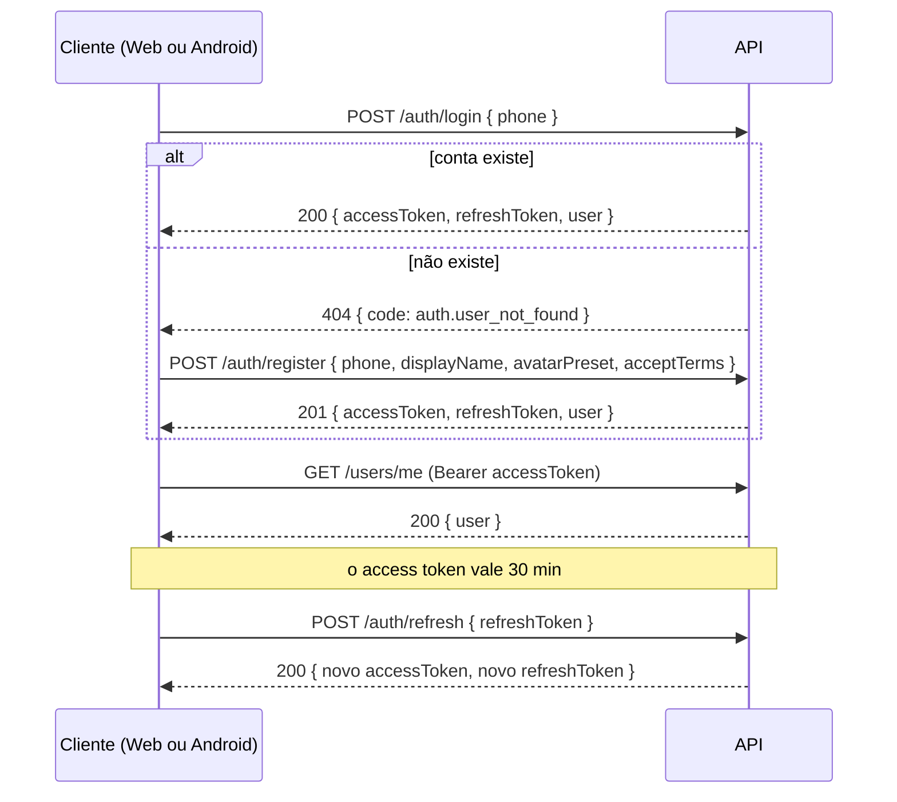
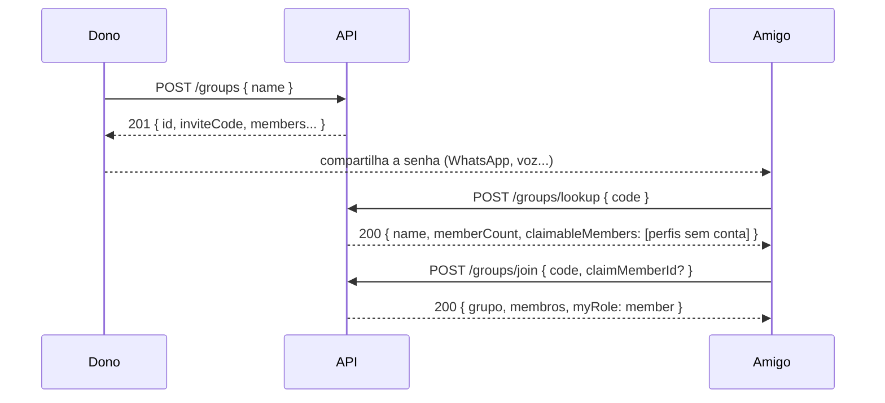
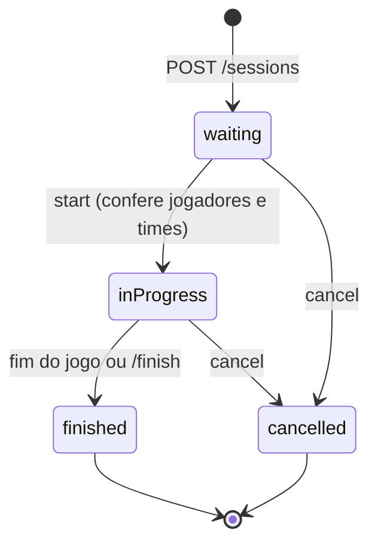

# API

REST + JSON em `/api/v1`, com tempo real por SignalR (em breve). O contrato completo e atualizado é o OpenAPI em
[`docs/openapi/v1.json`](openapi/v1.json); em desenvolvimento há uma interface interativa em `/scalar/v1`.

## Convenções

| Tema | Regra |
|---|---|
| **Versão** | prefixo `/api/v1`. Mudanças que quebram o contrato exigem `/api/v2`; campos novos são sempre opcionais (APKs antigos continuam em uso). `GET /api/v1/meta` informa `minClientVersion`: abaixo dela o app pede atualização. |
| **JSON** | `camelCase`; datas ISO-8601 em UTC; enums como texto `camelCase`; números estritos (`5` e não `"5"`). |
| **Autenticação** | `Authorization: Bearer <accessToken>`. Sem cookies. |
| **Erros** | `application/problem+json` (RFC 9457) com `code` **estável** (use-o para decidir o que fazer), `detail` em português para exibir, `traceId` para suporte e, em validações, `errors` por campo. Esquema `ApiProblem`. |
| **Limite de taxa** | `429` com `Retry-After` e `code: rate_limit.exceeded`. |
| **Rastreio** | toda resposta traz `X-Trace-Id`. |
| **CORS** | só origens configuradas (lista explícita). Para SignalR, o cliente deve usar `withCredentials: false` ou a origem precisa estar na lista. |
| **Cache** | respostas da API não são armazenadas (`no-store`); a imagem de uma foto de avatar é pública, imutável e cacheável por um ano (`ETag`, `immutable`). |

Exemplo de erro:

```json
{
  "type": "urn:ronat-ia:error:auth.user_not_found",
  "title": "Não encontrado",
  "status": 404,
  "detail": "Não existe conta com este telefone. Cadastre-se para continuar.",
  "code": "auth.user_not_found",
  "traceId": "4bf92f3577b34da6a3ce929d0e0e4736"
}
```

## Entrada (sem SMS e sem senha)

O telefone é só o identificador (ADR-0003). Não há verificação por mensagem.



- **Telefone:** aceito com ou sem código do país e com qualquer máscara (`(11) 98888-7777`, `+55 11 98888-7777`...). Padrão: Brasil.
- **Access token:** 30 min. Guarde em memória.
- **Refresh token:** 90 dias, **de uso único**: cada renovação devolve um novo e invalida o anterior. Guarde no armazenamento seguro do aparelho (Android: Keystore). Se a resposta da renovação se perder, repetir a chamada com o mesmo token funciona por 15 s; depois disso, reapresentar um token já trocado derruba a sessão (sinal de roubo).
- **Antes de renovar:** só use o token novo depois de recebê-lo; nunca dispare duas renovações ao mesmo tempo.
- **Várias sessões:** cada aparelho tem a sua (máx. 10). `GET /auth/sessions` lista, `DELETE /auth/sessions/{id}` desconecta um aparelho, `POST /auth/logout-all` desconecta todos.
- **Captcha:** quando `GET /api/v1/meta` informa `auth.captchaRequired: true`, mostre o widget do Cloudflare Turnstile (chave pública em `auth.captchaSiteKey`) e envie o token em `captchaToken` no login e no cadastro.
- **Cadastro fechado:** se `auth.registrationOpen` for `false`, o cadastro responde `403 auth.registration_closed`; quem já tem conta continua entrando.

## Perfil e avatar

Todo `user` devolvido pela API traz `avatar`: `{ "kind": "preset", "preset": "preset-3", "url": null }` (avatar pronto; as imagens
prontas vivem no Front, com o nome da chave) ou `{ "kind": "photo", "preset": null, "url": "/api/v1/avatars/<id>" }` (foto
enviada; prefixe `url` com a URL base da API). Sempre é um dos dois.

- **Avatares prontos:** `GET /avatars/presets` (público, usado na tela de cadastro) lista as chaves e o padrão.
- **Escolher um pronto ou mudar o nome:** `PATCH /users/me` com `{ displayName?, avatarPreset? }`; só o que for enviado muda. Escolher um pronto descarta a foto.
- **Enviar foto:** `PUT /users/me/avatar`, `multipart/form-data`, campo `file`. Aceita JPEG, PNG, WebP e GIF de até **3 MB**. O servidor **recorta em quadrado pelo centro, reduz para 256×256, reencoda em WebP e descarta todos os metadados** (inclusive a localização do GPS); a rotação do EXIF é respeitada. O original nunca é guardado. Limite: 20 envios por hora por pessoa. Enviar de novo substitui (e apaga) a foto anterior.
- **Remover a foto:** `DELETE /users/me/avatar` volta ao avatar padrão (idempotente).
- **Ver a foto:** `GET /avatars/{id}` é público (é um `` simples, sem token), não adivinhável e imutável: `Cache-Control: public, max-age=31536000, immutable`, com `ETag` (responde `304` a `If-None-Match`).
- **Excluir a conta:** `DELETE /users/me` com `{ "confirmation": "EXCLUIR" }` (LGPD). Anonimiza os dados, apaga a foto, encerra todas as sessões e **libera o telefone** para um novo cadastro. Não dá para desfazer.

## Grupos e a senha do grupo

Quem cria um grupo é o **dono** e recebe a *senha do grupo* (8 caracteres, ex.: `K7RM4PXT`) para compartilhar com os amigos; quem faz login com o telefone e informa a senha entra no grupo (ADR-0006).



- **A senha:** 8 caracteres de um alfabeto sem `I`, `L`, `O`, `U`, `0` e `1`. Maiúsculas, minúsculas, espaços e hífen são ignorados (`k7rm-4pxt`). Todo membro vê a senha (`inviteCode`) para repassar; dono e administradores podem **desativá-la** (`PATCH { inviteEnabled: false }`; enquanto desativada, `inviteCode` vem `null`) ou **gerar outra** (`POST /groups/{id}/invite-code`), que invalida a antiga na hora. Senha errada, desativada ou de grupo excluído respondem igual: `404 group.invalid_code`.
- **Conferir antes de entrar:** `POST /groups/lookup` devolve o nome, quantas pessoas há, se você já é membro e os **perfis sem conta** que dá para assumir. Conferir não entra no grupo. Entrar e conferir dividem o mesmo limite (10 por minuto por pessoa).
- **Entrar é idempotente:** quem já é membro recebe o grupo como está. Quem já esteve e saiu volta como **membro comum**, com o mesmo vínculo (e o histórico dele).
- **Papéis:** `owner` (um por grupo), `admin` e `member`.

  | Ação | Dono | Admin | Membro |
  |---|:-:|:-:|:-:|
  | Ver o grupo, a senha e os membros; sair | ✓ (sair: não) | ✓ | ✓ |
  | Renomear; ligar/desligar/gerar a senha | ✓ | ✓ | |
  | Criar, editar e remover perfis sem conta (nome, avatar, foto) | ✓ | ✓ | |
  | Remover membros comuns | ✓ | ✓ | |
  | Remover administradores | ✓ | | |
  | Promover a admin e rebaixar a membro | ✓ | | |
  | Transferir a propriedade; excluir o grupo | ✓ | | |

  O dono não sai nem é removido: transfere a propriedade (`POST /groups/{id}/transfer-ownership`, e ele vira admin) ou exclui o grupo (`DELETE /groups/{id}` com `{ "confirmation": "EXCLUIR" }`; lógico, o histórico fica).
- **Membros sem conta (perfis):** nome e avatar próprios, criados e geridos por dono/admin, para quem ainda não usa o app (ou para trazer a família do app antigo). Aparecem em `members` com `hasAccount: false`. Ao entrar com a senha, uma pessoa pode **assumir** um perfil (`claimMemberId`): o perfil vira a conta dela, no mesmo `member.id`, e o histórico vai junto; nome e avatar passam a ser os da conta. Só perfis ativos do mesmo grupo podem ser assumidos (`409 group.claim_unavailable`); se duas pessoas assumirem o mesmo perfil ao mesmo tempo, uma vence e a outra recebe esse `409`.
- **Quem não é membro recebe `404 group.not_found`**, nunca 403: o servidor não revela que o grupo existe.
- **Limites:** 20 grupos por pessoa, 100 membros por grupo (contando perfis; assumir um perfil não aumenta o grupo), 10 grupos criados por hora e por pessoa.
- **Excluir a conta:** quem é dono de grupo com outras pessoas precisa transferir a propriedade antes (`409 user.owns_groups`, com os nomes em `errors.groups`); os grupos em que é a única pessoa com conta são excluídos junto.
- **Identificadores:** `member.id` identifica a pessoa **dentro do grupo** (é o que o histórico de partidas usa); não é o id da conta.

## Jogos e partidas

Uma **partida** (`session`) é uma rodada de um jogo dentro de um grupo. O servidor é a **fonte da verdade**: o cliente envia *ações*, nunca pontuação, e só enxerga o que o jogo projeta para ele (ADR-0007; para criar um jogo, [`GAME_DEVELOPMENT.md`](GAME_DEVELOPMENT.md)).



- **Catálogo:** `GET /games` lista os jogos instalados com limites (`minPlayers`, `maxPlayers`), `teamCount` (0 = cada um por si) e `configDefaults` (a configuração padrão, para montar a tela de opções).
- **Lobby (`waiting`):** quem cria vira o **anfitrião** e já entra como jogador. Qualquer membro do grupo com conta entra por conta própria (`/join`, `/leave`); o anfitrião adiciona membros do grupo (inclusive **perfis sem conta**, para quem não tem celular), remove jogadores, define os times (`PUT /teams` ou o sorteio equilibrado `POST /teams/shuffle`) e ajusta a configuração (`PATCH /config`, que o jogo valida e normaliza). **Anfitrião e administradores do grupo gerenciam** (`canManage`). Os jogadores da partida são sempre **membros do grupo**: o `member.id` identifica a pessoa no histórico.
- **Começar:** `POST /start` confere o número de jogadores e, em jogos com times, que todos estejam alocados e cada time completo (`session.not_enough_players`, `session.teams_incomplete`...).
- **A visão da partida:** `GET /sessions/{id}` devolve o lobby, os placares (`players[].score`, `teamScores`) e a `view`, um JSON **próprio do jogo e só do que quem consultou pode ver** (a carta do mímico não aparece para os outros, nem na trilha de eventos). `allowedActions` diz o que esta pessoa pode enviar agora e `deadlineAt` o prazo da fase; o cliente não deduz isso. Membros do grupo que não jogam assistem com a visão pública (`myPlayerId` nulo).
- **Agir:** `POST /sessions/{id}/actions` com `{ clientActionId, type, payload }`. O jogo valida (quem pode, em que fase, dentro do prazo) e o servidor calcula os pontos. **`clientActionId` (UUID gerado pelo cliente) torna o envio idempotente:** reenviar o mesmo (rede ruim, duas abas) devolve o estado atual com `replayed: true`, sem reaplicar. Recusas do jogo: `400` (ação malformada), `403` (não é a sua vez ou papel) ou `409` (outra fase, prazo vencido), cada uma com o `code` do jogo (`jogo.motivo`).
- **Sincronização:** `version` sobe a cada mudança; o cliente compara para saber se há novidade. O **tempo real** (SignalR, `/hubs/sessions`) entrega a cada pessoa a partida com a visão própria dela a cada mudança, e a presença de quem está online: veja [`REALTIME.md`](REALTIME.md). Sem tempo real (ou ao reconectar), `GET /sessions/{id}` mostra o mesmo estado.
- **Concorrência:** se várias pessoas agem ao mesmo tempo, o servidor as serializa; a que perde é reavaliada sobre o estado novo (pode virar uma recusa legítima do jogo, ex.: "o turno já passou"). Só persistindo o conflito, `409 session.concurrent_update` (o lobby também: tente de novo).
- **Trilha:** `GET /sessions/{id}/events?after=<seq>&limit=` devolve os eventos em ordem, com sequência contínua e **só fatos públicos** (o conteúdo das ações nunca é gravado).
- **Fim:** o jogo encerra sozinho (`status: finished`, `standings` com posição, pontos e vencedores) ou o anfitrião encerra antes (`POST /finish`, vale o placar do momento). `POST /cancel` abandona sem resultado. **Revanche:** `POST /rematch` cria uma partida nova no lobby com o mesmo jogo, configuração e jogadores (e times) da que terminou ou foi cancelada.
- **Limites:** 5 partidas abertas por grupo; 30 partidas criadas por hora e 240 ações por minuto por pessoa.
- **Quem não é membro do grupo recebe `404 session.not_found`**, nunca 403.

## Endpoints atuais

| Método | Rota | Auth | Descrição |
|---|---|---|---|
| GET | `/api/v1/meta` | não | versão da API, versão mínima do cliente, hora do servidor, estado de cadastro/captcha |
| POST | `/api/v1/auth/login` | não | entra com o telefone; `404 auth.user_not_found` se não houver conta |
| POST | `/api/v1/auth/register` | não | cria a conta (telefone, nome, avatar pronto) e inicia a sessão |
| POST | `/api/v1/auth/refresh` | não | troca o refresh token por um novo par |
| POST | `/api/v1/auth/logout` | sim | encerra a sessão atual |
| POST | `/api/v1/auth/logout-all` | sim | encerra todas as sessões da conta |
| GET | `/api/v1/auth/sessions` | sim | aparelhos conectados (marca o atual) |
| DELETE | `/api/v1/auth/sessions/{id}` | sim | desconecta um aparelho |
| GET | `/api/v1/users/me` | sim | perfil da própria pessoa |
| PATCH | `/api/v1/users/me` | sim | muda o nome e/ou escolhe um avatar pronto |
| DELETE | `/api/v1/users/me` | sim | exclui a conta (exige a confirmação `EXCLUIR`) |
| PUT | `/api/v1/users/me/avatar` | sim | envia a foto do avatar (`multipart/form-data`, campo `file`) |
| DELETE | `/api/v1/users/me/avatar` | sim | remove a foto e volta ao avatar padrão |
| GET | `/api/v1/avatars/presets` | não | chaves dos avatares prontos |
| GET | `/api/v1/avatars/{id}` | não | imagem de uma foto (WebP 256×256, cacheável) |
| GET | `/api/v1/groups` | sim | meus grupos (nome, papel, tamanho) |
| POST | `/api/v1/groups` | sim | cria um grupo (quem cria é o dono) e devolve a senha |
| POST | `/api/v1/groups/lookup` | sim | confere a senha: nome, tamanho e perfis que dá para assumir |
| POST | `/api/v1/groups/join` | sim | entra com a senha (`claimMemberId` opcional para assumir um perfil) |
| GET | `/api/v1/groups/{id}` | sim | grupo, senha e membros (404 para quem não é membro) |
| PATCH | `/api/v1/groups/{id}` | admin | renomeia e/ou liga/desliga a senha |
| DELETE | `/api/v1/groups/{id}` | dono | exclui o grupo (confirmação `EXCLUIR`) |
| POST | `/api/v1/groups/{id}/invite-code` | admin | gera outra senha (a antiga deixa de valer) |
| POST | `/api/v1/groups/{id}/transfer-ownership` | dono | passa a propriedade a outro membro com conta |
| DELETE | `/api/v1/groups/{id}/members/me` | membro | sai do grupo (o dono não pode) |
| POST | `/api/v1/groups/{id}/members` | admin | cria um membro sem conta |
| PATCH | `/api/v1/groups/{id}/members/{memberId}` | admin/dono | nome e avatar de um perfil sem conta (admin) ou papel (dono) |
| DELETE | `/api/v1/groups/{id}/members/{memberId}` | admin/dono | remove um membro (admin: só membros comuns) |
| PUT | `/api/v1/groups/{id}/members/{memberId}/avatar` | admin | foto de um perfil sem conta (`multipart/form-data`, campo `file`) |
| DELETE | `/api/v1/groups/{id}/members/{memberId}/avatar` | admin | remove a foto de um perfil sem conta |
| GET | `/api/v1/games`, `/api/v1/games/{gameId}` | sim | catálogo de jogos instalados (limites, times, configuração padrão) |
| POST | `/api/v1/sessions` | membro | cria uma partida no lobby (`{ groupId, gameId, config? }`); quem cria é o anfitrião |
| GET | `/api/v1/groups/{groupId}/sessions` | membro | partidas do grupo (as abertas primeiro) |
| GET | `/api/v1/sessions/{id}` | membro | a partida como quem consulta a enxerga (lobby, placares, `view` do jogo, `allowedActions`) |
| POST | `/api/v1/sessions/{id}/join`, `/leave` | membro | entra/sai do lobby (idempotente) |
| POST | `/api/v1/sessions/{id}/players` | gerente | adiciona um membro do grupo (inclusive perfil sem conta) |
| DELETE | `/api/v1/sessions/{id}/players/{playerId}` | gerente | remove um jogador do lobby |
| PUT | `/api/v1/sessions/{id}/teams` | gerente | define o time de cada jogador informado |
| POST | `/api/v1/sessions/{id}/teams/shuffle` | gerente | sorteia times equilibrados |
| PATCH | `/api/v1/sessions/{id}/config` | gerente | altera a configuração (só no lobby) |
| POST | `/api/v1/sessions/{id}/start` | gerente | começa a partida |
| POST | `/api/v1/sessions/{id}/actions` | jogador | envia uma ação (`{ clientActionId, type, payload? }`); idempotente |
| GET | `/api/v1/sessions/{id}/events` | membro | trilha de eventos públicos (`after`, `limit`) |
| POST | `/api/v1/sessions/{id}/finish` | gerente | encerra antes do fim (vale o placar do momento) |
| POST | `/api/v1/sessions/{id}/cancel` | gerente | cancela (no lobby ou em andamento) |
| POST | `/api/v1/sessions/{id}/rematch` | gerente | nova partida no lobby com o mesmo jogo, configuração e jogadores |
| GET | `/health/live`, `/health/ready` | não | processo; processo + banco |

*O tempo real (SignalR) está em [`REALTIME.md`](REALTIME.md). Ranking e histórico entram na próxima fase. "Gerente" = anfitrião da partida ou administrador do grupo.*

## Códigos de erro atuais

| Código | Status | Quando |
|---|---|---|
| `validation.failed` | 400 | corpo ou campos inválidos (veja `errors`) |
| `auth.invalid_phone` | 400 | telefone inválido |
| `auth.terms_not_accepted` | 400 | cadastro sem aceitar os termos |
| `auth.captcha_failed` | 400 | captcha ausente, inválido ou expirado (quando exigido) |
| `user.display_name_invalid` | 400 | nome fora das regras (2 a 30 caracteres, sem invisíveis) |
| `avatar.unknown_preset` | 400 | avatar pronto inexistente |
| `avatar.invalid_image` | 400 | o arquivo não é JPEG, PNG, WebP ou GIF válido (vazio, truncado, SVG, texto...) |
| `avatar.dimensions_too_large` | 400 | imagem com lado acima de 8000 px ou mais de 25 megapixels |
| `user.delete_not_confirmed` | 400 | exclusão de conta sem a confirmação `EXCLUIR` |
| `session.invalid_config` | 400 | a configuração não passou na validação do jogo (veja `errors` por campo) |
| `session.invalid_team` | 400 | time fora da faixa do jogo ou jogador repetido na lista |
| `action.invalid_payload` | 400 | os dados da ação não batem com o formato esperado pelo jogo |
| *`jogo.motivo`* | 400 | outras recusas de ação malformada, definidas por cada jogo (ex.: `relay.text_required`) |
| `group.name_invalid` | 400 | nome do grupo fora das regras (2 a 40 caracteres, sem invisíveis) |
| `member.display_name_invalid` | 400 | nome do perfil sem conta fora das regras (2 a 30 caracteres) |
| `group.invalid_role` | 400 | papel inválido (use `admin` ou `member`; para a propriedade, a transferência) |
| `group.delete_not_confirmed` | 400 | exclusão de grupo sem a confirmação `EXCLUIR` |
| `auth.unauthorized` | 401 | sem token, token inválido/expirado ou sessão encerrada |
| `auth.invalid_refresh_token` | 401 | refresh token inválido, expirado ou já trocado |
| `auth.forbidden` | 403 | sem permissão |
| `group.forbidden` | 403 | é membro do grupo, mas o papel não permite a ação |
| `session.forbidden` | 403 | só o anfitrião da partida ou um administrador do grupo pode fazer isso |
| `session.not_a_player` | 403 | quem não joga nem gerencia a partida tentou agir |
| *`jogo.motivo`* | 403 | ação recusada pelo jogo: não é a sua vez ou o seu papel (ex.: `relay.not_performer`) |
| `auth.account_suspended` | 403 | conta suspensa |
| `auth.registration_closed` | 403 | cadastros fechados |
| `auth.user_not_found` | 404 | não existe conta com esse telefone (siga para o cadastro) |
| `auth.session_not_found` | 404 | sessão inexistente ou de outra conta |
| `avatar.not_found` | 404 | foto inexistente (ou já substituída) |
| `user.not_found` | 404 | a conta do token não existe mais |
| `group.not_found` | 404 | grupo inexistente, excluído ou do qual a pessoa não é membro |
| `group.invalid_code` | 404 | senha do grupo inválida, desativada ou de grupo excluído |
| `member.not_found` | 404 | o membro não está (ativo) neste grupo |
| `game.not_found` | 404 | o jogo não está instalado |
| `session.not_found` | 404 | partida inexistente ou de um grupo do qual a pessoa não é membro |
| `session.player_not_found` | 404 | o jogador não está nesta partida |
| `auth.phone_taken` | 409 | já existe conta com esse telefone |
| `auth.refresh_conflict` | 409 | duas renovações simultâneas; tente de novo |
| `group.limit_reached` | 409 | a pessoa já está no máximo de grupos (20) |
| `group.full` | 409 | o grupo já tem o máximo de membros (100) |
| `group.already_member` | 409 | tentou assumir um perfil já sendo membro do grupo |
| `group.claim_unavailable` | 409 | o perfil não existe, já foi assumido, foi removido, é de outro grupo ou a pessoa já esteve no grupo |
| `group.owner_cannot_leave` | 409 | o dono não sai nem é removido: transfira a propriedade ou exclua o grupo |
| `group.owner_role_fixed` | 409 | o papel do dono só muda transferindo a propriedade |
| `group.transfer_invalid` | 409 | a propriedade só passa a outro membro com conta |
| `member.has_account` | 409 | nome/avatar/foto só se mudam em perfis sem conta (quem tem conta usa o próprio perfil) |
| `member.no_account` | 409 | perfil sem conta não pode ser administrador |
| `group.concurrent_update` | 409 | duas pessoas mudaram o grupo ao mesmo tempo; tente de novo |
| `user.owns_groups` | 409 | exclusão de conta de quem é dono de grupo com outras pessoas (`errors.groups` lista os nomes) |
| `session.limit_reached` | 409 | o grupo já tem o máximo de partidas abertas (5) |
| `session.not_waiting` | 409 | a operação só vale no lobby e a partida já começou ou terminou |
| `session.not_in_progress` | 409 | a operação (ação, encerrar) exige a partida em andamento |
| `session.already_ended` | 409 | tentou cancelar uma partida que já terminou |
| `session.not_ended` | 409 | revanche antes de a partida terminar ou ser cancelada |
| `session.full` | 409 | a partida já tem o máximo de jogadores do jogo |
| `session.not_enough_players` / `session.too_many_players` | 409 | número de jogadores fora dos limites do jogo ao começar |
| `session.teams_incomplete` | 409 | jogo com times: há jogador sem time ou time com menos que o mínimo |
| `session.no_teams` | 409 | operação de times num jogo que não tem times |
| `session.concurrent_update` | 409 | a partida mudou ao mesmo tempo por outra ação e o conflito persistiu; tente de novo |
| *`jogo.motivo`* | 409 | ação recusada pelo jogo por fase ou prazo (ex.: `relay.turn_expired`) |
| `avatar.too_large` | 413 | foto acima de 3 MB |
| `request.too_large` | 413 | o envio inteiro passa do limite (a foto + folga do multipart) |
| `rate_limit.exceeded` | 429 | muitas requisições |
| `server.error` | 500 | erro inesperado (informe o `traceId`) |
| `group.code_generation_failed` | 503 | não foi possível gerar uma senha única agora; tente de novo |

## Contrato OpenAPI

`docs/openapi/v1.json` é gerado pelo próprio ASP.NET Core e **verificado por teste**: se a API mudar e o arquivo não for atualizado, o CI falha, e a mudança de contrato aparece no diff do PR. Para atualizar:

```bash
UPDATE_OPENAPI=1 dotnet test --filter OpenApiContractTests
```

O Front gera seus tipos a partir desse arquivo (`openapi-typescript`).
