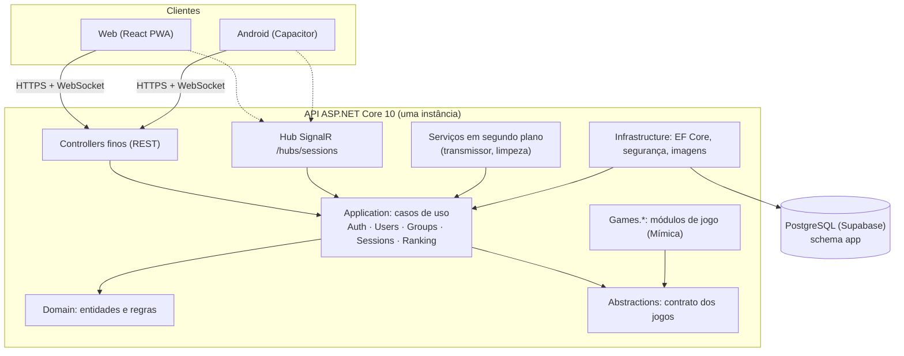
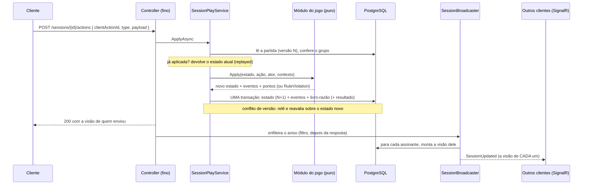
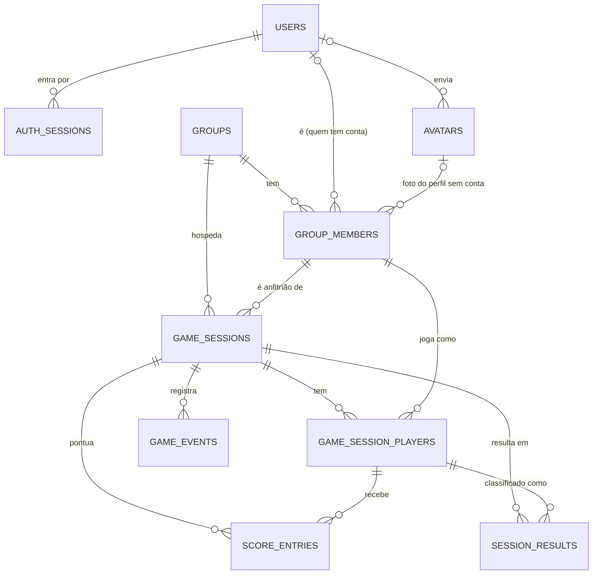

# Arquitetura

Visão geral do backend da plataforma **Ronat-ia Games**: jogos multiplayer para amigos e família, começando pela Mímica. Os detalhes de cada decisão estão nos [ADRs](adr/README.md); aqui está o mapa para se orientar.

## Princípios

1. **O servidor é a fonte da verdade.** O cliente envia *ações*, nunca pontuação; regras, tempo, ordem e placar são calculados aqui.
2. **Cada pessoa só recebe o que pode ver.** Informação secreta de um jogo (a carta do mímico) vive no estado, mas só sai pela *projeção* de quem pode vê-la, no REST e no tempo real.
3. **Jogos são módulos puros.** Uma máquina de estados `(estado, ação, quem, contexto) → (novo estado, eventos, pontos)`, sem banco, rede nem relógio próprios. Adicionar um jogo não mexe em contas, grupos nem partidas.
4. **Tempo é dado.** Prazos ficam no estado e são avaliados quando chega uma ação ou uma leitura; não há timers em memória (a hospedagem gratuita dorme e reinicia).
5. **Simples primeiro.** Monólito modular numa instância, sem filas, caches ou microsserviços; o banco guarda o estado.
6. **Contrato primeiro.** O OpenAPI gerado pela API é verificado por teste e é a fonte dos tipos do Front.

## Visão de componentes

## Estrutura da solução

| Projeto | Papel | Depende de |
|---|---|---|
| `RonatIa.Games.Domain` | entidades e regras da plataforma (usuário, grupo, membro, partida, jogador, resultado); exceções de negócio (`AppException`) | nada |
| `RonatIa.Games.Abstractions` | o contrato dos jogos: `IGameModule`, estado, ação, evento, visão por jogador, `RuleViolation` | nada |
| `RonatIa.Games.Application` | casos de uso: autenticação, perfil e fotos, grupos, partidas (lobby e jogo), ranking, limpeza | Domain, Abstractions |
| `RonatIa.Games.Infrastructure` | EF Core + Npgsql e migrações, segurança (JWT, HMAC do telefone, Turnstile), imagens (SkiaSharp) | Application |
| `RonatIa.Games.Api` | controllers, hub SignalR, autenticação, pipeline HTTP, OpenAPI, serviços em segundo plano; instala os jogos | Application, Infrastructure, `Games.*` |
| `Games/RonatIa.Games.Mimica` | o jogo Mímica (regras e as 640 cartas) | **só** Abstractions |

Regras de dependência (garantidas pelo compilador): `Api → Application, Infrastructure`; `Infrastructure → Application`; `Application → Domain, Abstractions`; `Games.* → Abstractions` apenas. Um módulo de jogo não enxerga EF, HTTP nem SignalR. O DbContext é a unidade de trabalho: sem repositórios genéricos, sem MediatR, sem AutoMapper (mapeamento manual).

## Como as coisas se encaixam

### Contas e sessões
Login **só por telefone** (sem SMS, sem senha), guardado como HMAC + 4 últimos dígitos; JWT de 30 min + *refresh token* rotativo com revogação imediata. → [ADR-0003](adr/0003-login-so-por-telefone.md), [ADR-0004](adr/0004-sessoes-e-tokens.md), [SECURITY.md](SECURITY.md).

### Grupos
Quem cria é o dono e recebe a **senha do grupo** (8 caracteres) para compartilhar; quem tem a senha entra. Membros **sem conta** (perfis com nome e foto) existem para a família que ainda não usa o app e podem ser assumidos ao entrar, herdando o histórico. Quem não é membro recebe 404. → [ADR-0006](adr/0006-grupos-senha-compartilhada-e-perfis-sem-conta.md).

### Partidas e jogos
Uma partida (`game_sessions`) é uma rodada de um jogo dentro de um grupo; os jogadores são **membros do grupo**. A plataforma cuida do ciclo de vida (lobby, times, configuração, começar, cancelar, encerrar, revanche), da versão, da idempotência, da trilha de eventos, do livro-razão de pontos e do resultado; o módulo do jogo cuida só das regras. → [ADR-0007](adr/0007-motor-de-partidas-modulos-puros.md), [GAME_DEVELOPMENT.md](GAME_DEVELOPMENT.md), [games/MIMICA.md](games/MIMICA.md).

Uma ação de jogo, de ponta a ponta:

### Tempo real
O hub **só avisa e entrega a visão**; quem age usa o REST. Cada assinante recebe a sua visão, montada pelo mesmo código do REST. → [ADR-0008](adr/0008-tempo-real-signalr-avisa-e-entrega-a-visao.md), [REALTIME.md](REALTIME.md).

### Ranking e limpeza
O ranking é calculado dos resultados das partidas encerradas (o histórico pertence ao membro do grupo). Um serviço em segundo plano cancela lobbies e partidas abandonados e apaga dados antigos. → [ADR-0009](adr/0009-ranking-dos-resultados-e-limpeza-automatica.md).

## Dados

Todas as tabelas ficam no schema `app` (o `public` do Supabase fica vazio), com RLS ligado e sem políticas (o backend é o único cliente do banco). IDs `uuid` v7 gerados pela aplicação; tempo em `timestamptz` UTC; enums como texto + `CHECK`. As regras importantes também vivem no banco (índices únicos parciais, `CHECK`s), com testes que as violam direto no SQL. → [DATABASE.md](DATABASE.md).

## Segurança em camadas

Rede e transporte (TLS, CORS por lista, cabeçalhos), identidade (JWT curto + revogação imediata, deny-by-default em todos os controllers), autorização por recurso no servidor (membro do grupo, papel, jogador/anfitrião), abuso (limites por IP e por pessoa, Turnstile opcional), dados (HMAC do telefone, fotos reencodadas, RLS, restrições no banco) e segredo de jogo (projeção por jogador). → [SECURITY.md](SECURITY.md).

## Testes

| Camada | O quê | Como |
|---|---|---|
| Domínio | entidades, permissões, senha do grupo | xUnit, sem infraestrutura |
| Contrato dos jogos | `GameState`/`GameAction`/`RuleViolation` e o exemplo de `GAME_DEVELOPMENT.md` | xUnit |
| Módulos de jogo | regras, segredo, baralho, conteúdo | xUnit, sem infraestrutura (relógio e sorteio injetados) |
| Infraestrutura | telefone, JWT, refresh token, Turnstile | xUnit |
| API (integração) | ponta a ponta contra **PostgreSQL real**: autenticação, grupos, partidas, concorrência, idempotência, vazamento de segredo, ranking, limpeza; **SignalR** com cliente real (long polling no `TestServer` e WebSocket sobre Kestrel); contrato OpenAPI | `WebApplicationFactory` + um banco descartável por classe de teste |

CI (`build-test`): formatação, build Release com avisos como erro, todos os testes e auditoria de pacotes; `secrets-scan` (gitleaks).

## Limitações conhecidas

- **Uma instância:** o registro de assinantes do tempo real e a fila de avisos são em memória (backplane Redis se um dia precisar escalar).
- **Plano gratuito:** a API dorme após 15 min sem tráfego, e o Render não recomenda o plano gratuito para produção ([DEPLOY.md](DEPLOY.md)).
- **Login sem verificação:** quem souber o telefone de alguém entra na conta dessa pessoa (risco aceito, [ADR-0003](adr/0003-login-so-por-telefone.md)); a evolução prevista é verificação opcional atrás de configuração.
- **Estado de jogo em JSON opaco:** não se consulta bem por SQL; análises usam eventos e resultados.
- **Ainda não existem:** o importador privado dos dados da família, o segundo jogo ("adivinhar o ano") e o terceiro (Out of the Loop). O Front (Web e Android) está no repositório `Ronat-ia_Games_Front`.

## Decisões (ADRs)

| ADR | Tema |
|---|---|
| [0001](adr/0001-dois-repositorios.md) | dois repositórios (Front e Back) e banco como serviço |
| [0002](adr/0002-dotnet-monolito-modular.md) | .NET 10, monólito modular e módulos de jogo puros |
| [0003](adr/0003-login-so-por-telefone.md) | login só por telefone |
| [0004](adr/0004-sessoes-e-tokens.md) | sessões: JWT curto, refresh rotativo, revogação imediata |
| [0005](adr/0005-fotos-de-avatar-no-postgres.md) | fotos de avatar processadas no servidor e guardadas no PostgreSQL |
| [0006](adr/0006-grupos-senha-compartilhada-e-perfis-sem-conta.md) | grupos: senha compartilhada, perfis sem conta e reivindicação |
| [0007](adr/0007-motor-de-partidas-modulos-puros.md) | motor de partidas: módulos puros, estado opaco, versão e idempotência |
| [0008](adr/0008-tempo-real-signalr-avisa-e-entrega-a-visao.md) | tempo real: o hub avisa e entrega a visão |
| [0009](adr/0009-ranking-dos-resultados-e-limpeza-automatica.md) | ranking calculado dos resultados e limpeza automática |
