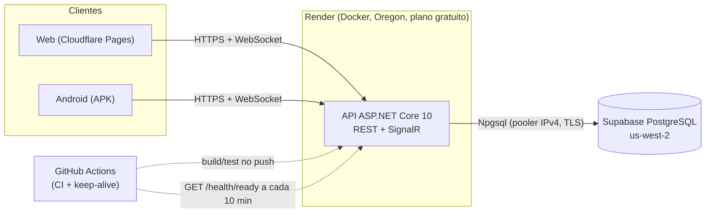

# Publicação (Render + Supabase)

A API roda em **Docker no Render** (região Oregon), o banco é um **PostgreSQL do Supabase** (us-west-2, Oregon) e a Web, no **Cloudflare Pages** (repositório Front). Tudo no plano gratuito, com as limitações descritas abaixo.



## O que você precisa

| Conta | Para quê | Custo |
|---|---|---|
| **Supabase** | banco PostgreSQL | gratuito (500 MB; pausa após 7 dias sem atividade) |
| **Render** | hospedar a API (Docker) | gratuito (750 h/mês; dorme após 15 min sem tráfego) |
| **Cloudflare** (opcional) | Turnstile (anti-bot) e Pages (Web) | gratuito |
| **GitHub** | código, CI e o *keep-alive* | gratuito |

> ⚠️ **O Render diz que o plano gratuito não é para produção** (sem garantias, dorme, 1 instância, sem disco). Para uso real contínuo, o plano pago mais barato (sempre ligado) resolve o "dormir" e mantém o resto igual. Veja "Limites e quando pagar".

## Passo a passo

### 1. Banco (Supabase)

1. Crie um projeto em **us-west-2** (Oregon) com uma senha forte. Para produção, use um projeto **separado** do de desenvolvimento (o plano gratuito permite dois ativos).
2. Pegue a string do **pooler em modo *session*** (Project Settings > Database > Connection string > *Session pooler*, porta **5432**):
   `Host=aws-0-us-west-2.pooler.supabase.com;Port=5432;Database=postgres;Username=postgres.<PROJECT_REF>;Password=<SENHA>;SSL Mode=Require;Trust Server Certificate=true;Maximum Pool Size=10`
   - **Nunca use a conexão direta** (`db.<ref>.supabase.co`): ela só resolve para IPv6, e o Render e os runners do GitHub Actions não têm IPv6.
   - O banco aceita 60 conexões no total (boa parte é do próprio Supabase): mantenha `Maximum Pool Size=10`.
   - `Trust Server Certificate=true` criptografa o tráfego mas **não valida o certificado**. Para endurecer, baixe o certificado raiz do Supabase e use `SSL Mode=VerifyFull;Root Certificate=<caminho>`.
3. As tabelas ficam no schema `app` (o `public` fica vazio) e todas têm RLS ligado sem políticas; a Data API do Supabase não expõe `app`. Confira em Project Settings > API que só `public` e `graphql_public` estão expostos.

### 2. Migrações

As migrações **não** rodam sozinhas na subida da API. Aplique-as antes de publicar uma versão que mude o banco:

```bash
# direto (precisa do .NET SDK e da string do pooler)
dotnet tool restore
ConnectionStrings__Default='<string do pooler>' dotnet ef database update \
  --project src/RonatIa.Games.Infrastructure --startup-project src/RonatIa.Games.Api

# ou gere um script SQL idempotente e rode-o no SQL Editor do Supabase
dotnet ef migrations script --idempotent -o migrar.sql \
  --project src/RonatIa.Games.Infrastructure --startup-project src/RonatIa.Games.Api
```

Toda migração termina ligando o RLS nas tabelas novas (há um teste que falha se esquecerem). Aplique a migração **antes** do deploy do código que depende dela; as migrações são aditivas, então a versão anterior da API continua funcionando durante a troca.

### 3. API (Render)

1. No Render: **New > Blueprint** e escolha este repositório; o arquivo [`render.yaml`](../render.yaml) descreve o serviço (Docker, Oregon, plano gratuito, *health check* em `/health/live`, deploy depois que o CI da `main` passa).
2. Preencha os valores secretos que o Render pedir (veja a tabela de variáveis):
   - `ConnectionStrings__Default`: a string do passo 1.
   - `Auth__PhonePepper`: `openssl rand -base64 48`. **Guarde uma cópia no gerenciador de senhas e nunca troque**: o telefone só existe como HMAC com este segredo, então trocá-lo invalida todos os logins e cadastros.
   - `Jwt__SigningKey`: `openssl rand -base64 64`.
   - `Cors__AllowedOrigins__0`: o endereço do front (ex.: `https://ronat-games.pages.dev`). Previews do Pages: `Cors__AllowedOriginPatterns__0` (regex).
3. Aguarde o build e confira:
   ```bash
   curl https://<servico>.onrender.com/health/live     # 200: o processo responde
   curl https://<servico>.onrender.com/health/ready    # 200: o banco também
   curl https://<servico>.onrender.com/api/v1/meta     # versão, versão mínima do cliente, hora do servidor, cadastro
   ```
   A API **se recusa a subir** com segredos ausentes, curtos (< 32 bytes) ou iguais aos valores públicos de desenvolvimento.

### 4. Manter acordado (opcional, recomendado)

O workflow [`keepalive.yml`](../.github/workflows/keepalive.yml) chama `/health/ready` a cada 10 min, das 08h às 23h59 (Brasília). Isso evita a espera de ~1 min na primeira partida do dia e mantém o Supabase ativo. Defina a variável de repositório **`API_URL`** (Settings > Secrets and variables > Actions > Variables) com o endereço da API; sem ela o workflow não faz nada.

- Manter a API ligada 24 h consome ~744 das 750 h gratuitas do mês; o horário limitado do workflow deixa folga.
- O GitHub desativa workflows agendados de repositórios sem atividade por 60 dias (um commit reativa).
- Com conexões WebSocket ativas ou mensagens chegando, o Render também mantém o serviço acordado.

### 5. Front

O Front (repositório `Ronat-ia_Games_Front`) precisa de `VITE_API_URL` (endereço da API), `VITE_TURNSTILE_SITE_KEY` (se usar anti-bot) e gera seus tipos do contrato `docs/openapi/v1.json`. A origem do front deve estar em `Cors__AllowedOrigins__*`; o SignalR deve usar `withCredentials: false`.

## Variáveis de ambiente

No ASP.NET Core, `__` nas variáveis de ambiente equivale a `:` na configuração. O modelo comentado está em [`.env.example`](../.env.example).

| Variável | Obrigatória | Secreta | Descrição |
|---|---|---|---|
| `ConnectionStrings__Default` | sim | **sim** | pooler do Supabase (modo *session*) |
| `Auth__PhonePepper` | sim | **sim, insubstituível** | segredo do HMAC do telefone (≥ 32 bytes em base64) |
| `Jwt__SigningKey` | sim | **sim** | chave de assinatura do JWT (≥ 32 bytes em base64) |
| `Jwt__PreviousSigningKey` | não | **sim** | chave antiga, aceita só para validar tokens ainda vigentes durante uma rotação |
| `Cors__AllowedOrigins__N` | sim | não | origens exatas do front (nunca `*`) |
| `Cors__AllowedOriginPatterns__N` | não | não | expressões regulares para previews |
| `Registration__Mode` | não (`Open`) | não | `Open` ou `Closed` (bloqueia novos cadastros; quem já tem conta segue entrando) |
| `Turnstile__SecretKey` / `Turnstile__SiteKey` | não | a primeira, sim | anti-bot do Cloudflare; vazio = desligado |
| `Client__MinClientVersion` | não (`0.0.0`) | não | abaixo dela o app pede atualização (APKs não se atualizam sozinhos) |
| `PORT` | automática | não | o Render define |
| `Docs__Enabled` | não (`false`) | não | liga a documentação interativa (`/scalar/v1`) fora do desenvolvimento |
| `RateLimiting__*` | não | não | `Enabled`, `AuthLoginPerMinute`, `AuthRegisterPerHour`, `AuthRefreshPerMinute`, `UploadPerHour`, `GroupCreatePerHour`, `GroupJoinPerMinute`, `SessionCreatePerHour`, `SessionActionPerMinute` |
| `Groups__*` | não | não | `MaxGroupsPerUser` (20), `MaxMembersPerGroup` (100) |
| `Sessions__*` | não | não | `MaxActiveSessionsPerGroup` (5), `MaxEventsPerPage` (200) |
| `Avatars__*` | não | não | `MaxUploadBytes` (3 MB), `Size` (256), `MaxSourceDimension` (8000), `MaxSourcePixels` (25 milhões), `WebpQuality` (80) |
| `Maintenance__*` | não | não | `Enabled` (`true`), `Interval` (1 h), `AbandonedLobbyAfter` (12 h), `AbandonedGameAfter` (24 h), `EventRetention` (60 dias), `LoginRetention` (30 dias) |
| `Auth__MaxSessionsPerUser` | não (10) | não | aparelhos conectados por conta |

> Nada secreto vai para o Git (o repositório é **público**): nem `.env`, nem senhas, nem o *pepper*. Localmente use `dotnet user-secrets`.

## Operação

- **Logs:** painel do Render (saída padrão, estruturados). Não registram telefone, nome, token nem query strings.
- **Reverter uma versão:** no Render, *Deploys* > escolha o deploy anterior > *Rollback*. Como as migrações são aditivas, a versão anterior continua compatível com o banco.
- **Girar a chave do JWT:** ponha a chave atual em `Jwt__PreviousSigningKey`, a nova em `Jwt__SigningKey` e publique; remova a antiga depois de 30 min (tempo de vida do access token).
- **Girar a senha do banco:** troque no Supabase, atualize `ConnectionStrings__Default` no Render e republique. (As credenciais usadas no desenvolvimento deste projeto foram coladas numa conversa: **troque-as** antes de qualquer uso real; veja a issue de rotação de credenciais.)
- **Cadastro fechado:** `Registration__Mode=Closed` bloqueia novos cadastros sem afetar quem já tem conta.
- **Backup:** o plano gratuito do Supabase não inclui backup gerenciado com restauração (confirme no painel). Faça um `pg_dump` periódico e guarde **em local privado**: `pg_dump "<string do pooler em URI>" --schema=app --format=custom --file=ronat-AAAA-MM-DD.dump`. **Nunca** publique o dump como artefato de um workflow deste repositório (artefatos de repositórios públicos são acessíveis): ele contém dados pessoais.
- **Dependabot e CI:** o CI (`build-test`, `secrets-scan`) roda a cada push na `main`; o deploy só sai depois que ele passa.

## Limites e quando pagar

| Serviço | Limite no plano gratuito | Efeito | Gatilho para pagar |
|---|---|---|---|
| **Render** | dorme após 15 min sem tráfego (~1 min para acordar); 750 h/mês; 0,1 CPU e 512 MB; 1 instância; disco efêmero; sem SMTP; "não use em produção" | primeira requisição lenta; sem *scale-out*; estado em memória (assinantes do tempo real) se perde ao reiniciar | uso diário contínuo (sempre ligado) |
| **Supabase** | 500 MB de banco; pausa após 7 dias sem atividade; 60 conexões; sem backup gerenciado | o *keep-alive* evita a pausa; a limpeza automática evita o estouro de espaço (ADR-0009) | banco acima de ~400 MB ou necessidade de backup/restauração |
| **Cloudflare Pages / Turnstile** | folgado para este uso | | |
| **GitHub** | repositórios públicos: Actions gratuito | | |

Memória: a API usa SkiaSharp para tratar fotos; 2 decodificações simultâneas no máximo e imagens de até 25 megapixels. Em 512 MB isso cabe; se aparecerem reinícios por memória, reduza `Avatars__MaxSourcePixels`.

## Checklist de produção

- [ ] Projeto Supabase de produção criado (separado do de desenvolvimento), senha forte, Data API sem expor `app`.
- [ ] Migrações aplicadas; `GET /health/ready` verde.
- [ ] `Auth__PhonePepper` guardado também no gerenciador de senhas.
- [ ] Credenciais de desenvolvimento (que passaram por conversas) trocadas; `Jwt__SigningKey` próprio de produção.
- [ ] `Cors__AllowedOrigins__*` com o endereço real do front.
- [ ] Turnstile configurado (ou conscientemente desligado) e `Registration__Mode` decidido.
- [ ] `API_URL` definida para o *keep-alive*.
- [ ] Rotina de `pg_dump` em local privado.
