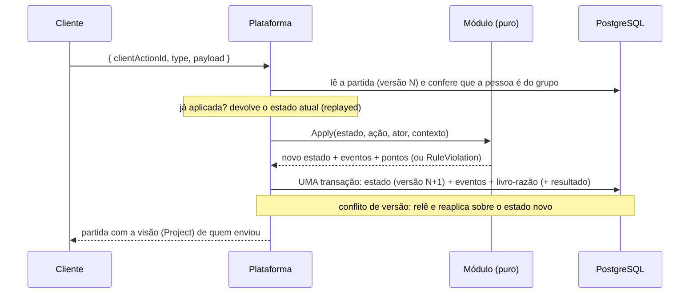

# Como criar um jogo

Um jogo é um **módulo puro**: uma máquina de estados sem banco, rede nem relógio próprios (ADR-0007). A plataforma cuida de contas, grupos, lobby, times, versão, idempotência, eventos, pontuação e resultado; o módulo cuida só das **regras**. Adicionar um jogo não exige mexer em nada disso.

## Passo a passo

1. **Crie o projeto** `src/Games/RonatIa.Games.<Nome>/` (biblioteca `net10.0`) com **uma única** referência: `RonatIa.Games.Abstractions`. Um módulo não enxerga EF Core, HTTP nem SignalR (o compilador garante). Adicione-o à solução na pasta `src`.
2. **Implemente `IGameModule`** (veja abaixo).
3. **Registre** em `src/RonatIa.Games.Api/Startup/GameModules.cs`: `services.AddSingleton<IGameModule, MeuJogo>();` e referencie o projeto no `RonatIa.Games.Api`. O jogo passa a aparecer em `GET /api/v1/games`.
4. **Teste** o módulo sem infraestrutura (xUnit, projeto `RonatIa.Games.<Nome>.Tests` que referencia só o módulo) e, no que for da plataforma, com os testes de integração (os jogos de teste `relay` e `solo`, em `tests/RonatIa.Games.Api.Tests/Infrastructure/TestGames.cs`, são a implementação de referência).

## O contrato

```csharp
public interface IGameModule
{
    GameDefinition Definition { get; }                       // id, nome, versão das regras, limites de jogadores, times
    ConfigResult ValidateConfig(JsonElement? config);        // valida e normaliza a configuração da partida
    GameTransition Start(GameSetup setup, IGameContext ctx); // estado inicial a partir dos jogadores (e times) do lobby
    GameTransition Apply(GameState state, GameAction action, GameActor actor, IGameContext ctx); // PURA
    PlayerView Project(GameState state, GameActor viewer, IGameContext ctx);                     // o que ESTE jogador vê
    GameResult Finish(GameState state);                      // classificação com o estado atual
}
```

| Tipo | Para quê |
|---|---|
| `GameDefinition` | `Id` (slug estável, ex.: `mimica`), `Name`, `Description`, `RulesVersion`, `MinPlayers`/`MaxPlayers`, `TeamCount` (0 = cada um por si; N = N times), `MinPlayersPerTeam` e `ConfigDefaults` (JSON; a tela de opções do cliente parte dele). |
| `GameSetup` | o que `Start` recebe: os jogadores (`SetupPlayer`: `PlayerId`, `Team`, `Seat` e `HasAccount`) e a configuração já normalizada. `HasAccount` é falso para um **perfil sem conta** (quem não tem celular): o anfitrião age por essa pessoa, e o jogo decide o que isso muda (na Mímica, o anfitrião passa a ver a carta do mímico sem conta). |
| `GameState` | `SchemaVersion` + `Data` (JSON). **Opaco para a plataforma.** Use `GameState.From(versão, objeto)` e `estado.Read<T>()`. Suba o `SchemaVersion` quando mudar o formato e saiba ler o antigo. |
| `GameAction` | `Type` + `Payload` (objeto JSON). `action.ReadPayload<T>()` lê os dados e, se não baterem com o tipo, já lança a recusa `action.invalid_payload` (400). |
| `GameActor` | quem age ou olha: `PlayerId` (nulo = só assiste ou gerencia), `Team` e `IsHost` (anfitrião da partida **ou administrador do grupo**). |
| `GameTransition` | `State` novo, `Events`, `Points` e `IsFinished`. `GameTransition.Of(estado)` quando não há eventos nem pontos. |
| `GameEvent` | fato **público** do jogo (`GameEvent.Of("mimica.acertou", new { ... }, atorId)`). **Nunca** ponha um segredo aqui. |
| `ScoreChange` | pontos para um jogador, um time ou os dois. Só o servidor pontua; o total é a soma do livro-razão. |
| `PlayerView` | a visão do jogador: um JSON do jogo, as `AllowedActions` (o cliente não deduz o que é válido) e o `DeadlineAt` da fase. |
| `GameResult` | a classificação (`PlayerStanding`: jogador, time, pontos, posição, se venceu). Empate é decisão sua. |
| `IGameContext` | `Now` (horário do servidor) e `Random` (sorteio). Em teste, injete um horário fixo e um sorteio com semente. |

## Regras de ouro

- **Pureza:** `Apply` não altera o estado recebido, não lê relógio nem sorteia por conta própria, não faz I/O. Tudo que varia vem de `ctx`. Se a plataforma refizer uma ação sobre um estado mais novo (corrida entre jogadores), o resultado tem de ser o mesmo para as mesmas entradas.
- **Segredo só pela projeção:** o estado guarda tudo (a carta, o papel de cada um), mas `Project` só devolve o que `viewer` pode ver. Quem só assiste recebe a visão pública. Escreva um teste de vazamento por segredo (a palavra não aparece na visão de quem não pode vê-la, nem nos eventos).
- **Tempo é dado:** guarde o prazo no estado (`deadlineAt`) e avalie-o em `Apply`/`Project` com `ctx.Now`. Não há timers: se ninguém agir, nada acontece. Dê o ato "pular/avançar" ao anfitrião (`actor.IsHost`) para destravar. Considere uma tolerância (graça) para a latência do celular.
- **Recuse com `RuleViolation`**, nunca devolva "ok" silencioso para uma ação inválida (nesse caso nada muda e nada é gravado):
  - `RuleViolation.Invalid("jogo.motivo", "mensagem")` → 400 (ação malformada);
  - `RuleViolation.NotAllowed(...)` → 403 (não é a sua vez/papel);
  - `RuleViolation.WrongState(...)` → 409 (outra fase, prazo vencido, partida já acabou).
  Os códigos são estáveis, no formato `jogo.motivo`, e a mensagem é em português, para exibir.
- **Quem pode agir** é regra sua: confira `actor.PlayerId`, o time e `actor.IsHost` em cada ação. A plataforma só garante que a pessoa é do grupo da partida e, para agir, é jogadora ou gerente.
- **Ações simultâneas** funcionam: o motor serializa por versão e reavalia a ação perdedora sobre o estado novo. Projete o estado pensando nisso (ex.: "o palpite chegou depois que o turno passou" vira um palpite errado ou uma recusa, não um erro).
- **Pontos:** devolva `ScoreChange` em `Apply` (e não some pontos no estado para depois "publicar"). O motor registra cada ponto com a sequência do evento que o gerou. O estado pode manter seu próprio placar para o `Finish`.
- **Fim da partida:** devolva `IsFinished: true` na transição que encerra; o motor chama `Finish(estado)` e grava o resultado. Se o anfitrião encerrar antes, `Finish` é chamado com o estado do momento: ele precisa classificar **qualquer** estado.
- **Eventos pequenos e públicos:** ids e fatos (quem acertou, qual turno), nunca texto secreto. A trilha é paginada e visível para o grupo.
- **Configuração:** `ValidateConfig` recebe o que o cliente enviou (ou `null`) e devolve o objeto normalizado (padrões preenchidos, faixas respeitadas) ou os erros por campo (`ConfigResult.Invalid(campo, mensagem)`). A normalizada é o que fica salva na partida.
- **Conteúdo** (cartas, perguntas) fica no módulo, como recurso embutido com ids estáveis (o estado guarda ids, não textos), para o retomar não repetir e o texto poder ser corrigido sem migrar partidas.

## Exemplo mínimo

Um jogo "cada um por si" em que cada jogador soma de 1 a 3 pontos por ação e vence quem chega à meta (versão resumida do `solo` dos testes):

```csharp
public sealed class SomaGame : IGameModule
{
    public GameDefinition Definition { get; } = new(
        "soma", "Soma", "Chegue primeiro à meta.", RulesVersion: 1,
        MinPlayers: 2, MaxPlayers: 6, TeamCount: 0, MinPlayersPerTeam: 0,
        ConfigDefaults: GameJson.Parse("""{"target":10}"""));

    private sealed record State(int Target, Dictionary<Guid, int> Scores, bool Finished);
    private sealed record AddPayload(int N);
    private sealed record View(int Target, Dictionary<Guid, int> Scores, bool Finished);

    public ConfigResult ValidateConfig(JsonElement? config)
    {
        var target = 10;
        if (config is { ValueKind: JsonValueKind.Object } obj && obj.TryGetProperty("target", out var t)
            && (t.ValueKind != JsonValueKind.Number || !t.TryGetInt32(out target) || target is < 1 or > 100))
        {
            return ConfigResult.Invalid("target", "Use uma meta de 1 a 100.");
        }

        return ConfigResult.Valid(JsonSerializer.SerializeToElement(new { target }, GameJson.Options));
    }

    public GameTransition Start(GameSetup setup, IGameContext ctx) =>
        GameTransition.Of(GameState.From(1, new State(
            setup.Config.GetProperty("target").GetInt32(),
            setup.Players.ToDictionary(p => p.PlayerId, _ => 0),
            Finished: false)));

    public GameTransition Apply(GameState gameState, GameAction action, GameActor actor, IGameContext ctx)
    {
        var state = gameState.Read<State>();
        if (state.Finished) throw RuleViolation.WrongState("soma.finished", "A partida terminou.");
        if (action.Type != "add") throw RuleViolation.Invalid("soma.unknown_action", $"Ação desconhecida: {action.Type}.");
        if (actor.PlayerId is not { } me) throw RuleViolation.NotAllowed("soma.not_a_player", "Só quem joga pode pontuar.");

        var n = action.ReadPayload<AddPayload>().N;
        if (n is < 1 or > 3) throw RuleViolation.Invalid("soma.invalid_amount", "Some de 1 a 3.");

        state.Scores[me] += n;
        var finished = state.Scores[me] >= state.Target;
        return new GameTransition(
            GameState.From(1, state with { Finished = finished }),
            [GameEvent.Of("soma.somou", new { playerId = me, n }, me)],
            [new ScoreChange(me, Team: null, n, "add")],
            IsFinished: finished);
    }

    public PlayerView Project(GameState gameState, GameActor viewer, IGameContext ctx)
    {
        var state = gameState.Read<State>();
        return PlayerView.Of(new View(state.Target, state.Scores, state.Finished), state.Finished || !viewer.IsPlayer ? [] : ["add"]);
    }

    public GameResult Finish(GameState gameState)
    {
        var scores = gameState.Read<State>().Scores;
        var best = scores.Values.Max();
        return new GameResult(scores
            .Select(kv => new PlayerStanding(kv.Key, Team: null, kv.Value, Rank: 1 + scores.Count(o => o.Value > kv.Value), IsWinner: kv.Value == best))
            .ToList());
    }
}
```

## O que a plataforma faz por você

Uma ação (`POST /sessions/{id}/actions`) percorre este caminho; o módulo só participa do passo 3:



- **Ciclo de vida, lobby e times:** criar, entrar/sair, adicionar membros do grupo (inclusive perfis sem conta), sortear times, configurar, começar, cancelar, encerrar, revanche.
- **Autorização:** só membros do grupo; o anfitrião e administradores gerenciam; quem não joga assiste com a visão pública.
- **Trilha, pontuação e resultado:** eventos em ordem contínua, livro-razão de pontos, classificação final para os rankings.
- **Concorrência e idempotência:** versão otimista, reavaliação em corrida, `clientActionId`.

Os endpoints estão em [`API.md`](API.md); as decisões, no [ADR-0007](adr/0007-motor-de-partidas-modulos-puros.md).
