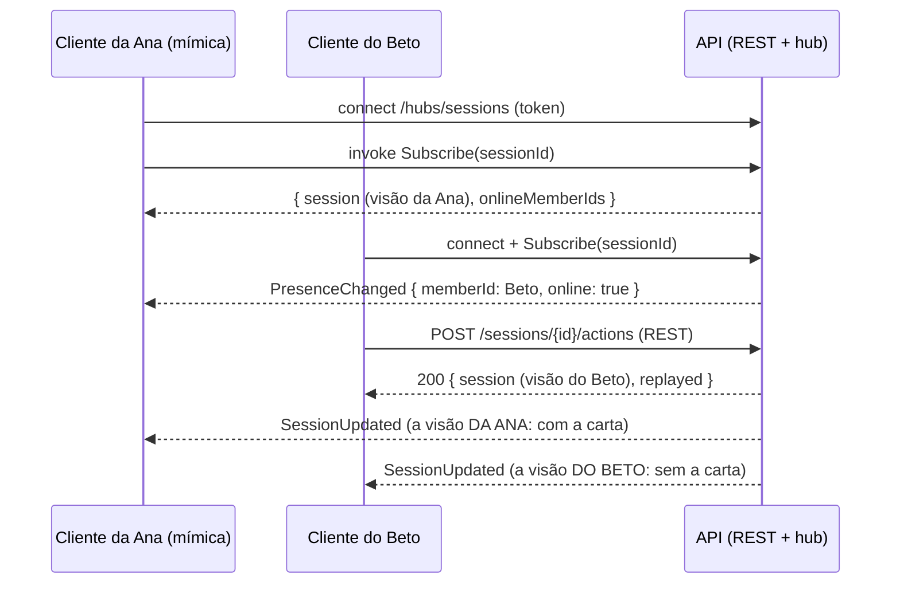

# Tempo real (SignalR)

O hub `/hubs/sessions` **avisa e entrega a visão**; quem **age** continua usando o REST (`POST /sessions/{id}/actions`...), então a autorização, a idempotência e a concorrência têm um caminho só (ADR-0008). O SignalR não está no OpenAPI: este documento é o contrato dele.

## Resumo



- **Cada pessoa recebe a visão própria dela.** O mesmo código do REST (`GET /sessions/{id}`) monta a mensagem de cada assinante; segredos de um jogador nunca vão na visão de outro. Há testes que conferem que a palavra secreta não aparece em nenhuma mensagem de quem não pode vê-la.
- **Reconectou? Assine de novo.** `Subscribe` devolve o estado **completo**; não há mensagens perdidas para repor.
- A mensagem tem o mesmo formato do REST (`GameSessionDto`): se um cliente receber uma atualização com `version` menor ou igual à que já tem, ignora.

## Conexão

| Item | Valor |
|---|---|
| URL | `{API}/hubs/sessions` |
| Autenticação | o **access token** (o mesmo do REST). O WebSocket não consegue enviar o cabeçalho `Authorization`, então o cliente SignalR manda o token na query (`?access_token=...`); isto só vale em `/hubs`: nas demais rotas, token na query é ignorado (401). Os logs da API não registram a query. |
| Transportes | WebSockets, com *long polling* como contingência |
| Keep-alive | a cada 15 s; o servidor considera a conexão perdida após 45 s sem notícias do cliente (o proxy do Render derruba conexões ociosas) |
| Expiração | o access token vale 30 min; **o servidor encerra a conexão quando o token expira**. O cliente reconecta com `accessTokenFactory` devolvendo um token renovado e assina de novo |
| Login encerrado | logout, "sair de todos os aparelhos" e suspensão valem na hora para **novas** conexões; numa conexão **já aberta**, valem no **próximo envio**: o aparelho recebe `AccessRevoked` e nada da partida (os outros aparelhos da pessoa seguem normalmente) |
| CORS | origens da lista da API. Use `withCredentials: false` no cliente |
| Tamanho | mensagens do cliente para o servidor: até 16 KB |

## Métodos (cliente → servidor)

| Método | Argumentos | Retorno | O que faz |
|---|---|---|---|
| `Subscribe` | `sessionId` | `{ session, onlineMemberIds }` | assina a partida. Só quem é membro do grupo dela (senão, `session.not_found`, igual ao REST). `session` é a visão **de quem assina**; `onlineMemberIds`, os membros do grupo com a tela da partida aberta agora. Os demais assinantes recebem `PresenceChanged`. Assinar de novo uma partida já assinada é inofensivo |
| `Unsubscribe` | `sessionId` | – | cancela a assinatura (os demais recebem `PresenceChanged`, se foi a última conexão do membro) |
| `SubscribeGroup` | `groupId` | – | assina os avisos de "a lista de partidas do grupo mudou" (para a tela do grupo recarregar `GET /groups/{id}/sessions`). Só membros |
| `UnsubscribeGroup` | `groupId` | – | cancela |

Cada conexão pode ter até **20 assinaturas** (partidas e grupos juntos); passar disso dá `realtime.too_many_subscriptions`.

**Erros** chegam como `HubException` com a mensagem `"<code>: <mensagem em português>"`, os mesmos `code` do REST (`session.not_found`, `group.not_found`, `realtime.too_many_subscriptions`...). Quem trata erros pode separar o `code` antes do primeiro `:`.

## Mensagens (servidor → cliente)

| Mensagem | Payload | Quando |
|---|---|---|
| `SessionUpdated` | `GameSessionDto` (ver o OpenAPI), **a visão de quem recebe** | depois de qualquer mudança na partida: entrar/sair do lobby, times, configuração, começar, **cada ação do jogo**, encerrar, cancelar |
| `PresenceChanged` | `{ sessionId, memberId, online }` | um membro abriu ou fechou a tela da partida (por todas as conexões dele: ter duas abas abertas não muda a presença até fechar as duas) |
| `RematchCreated` | `{ sessionId, newSessionId }` | o anfitrião criou a revanche da partida que o cliente assiste: é hora de ir para a nova |
| `AccessRevoked` | `{ sessionId }` | a pessoa deixou de ter acesso à partida (saiu ou foi removida do grupo). A assinatura foi encerrada; nada da partida é enviado depois disto |
| `GroupSessionsChanged` | `{ groupId }` | (só para quem assinou o grupo) uma partida do grupo foi criada, começou, terminou, foi cancelada ou teve gente entrando/saindo. É um aviso: busque a lista de novo. Jogadas no meio da partida **não** geram este aviso |

Avisos muito próximos da mesma partida podem chegar **juntados** (o servidor manda sempre o estado mais recente): o cliente não deve contar mensagens, só olhar a `version`.

## Receita para o cliente (TypeScript)

```ts
import { HubConnectionBuilder, HubConnectionState } from '@microsoft/signalr';

const connection = new HubConnectionBuilder()
  .withUrl(`${API}/hubs/sessions`, {
    accessTokenFactory: () => auth.currentAccessToken(), // chamado a cada (re)conexão: devolva um token válido
    withCredentials: false,
  })
  .withAutomaticReconnect()
  .build();

let current: GameSession | undefined;

connection.on('SessionUpdated', (session: GameSession) => {
  if (!current || session.version > current.version) current = session; // ignora o que é velho
  render(current);
});
connection.on('PresenceChanged', ({ memberId, online }) => setOnline(memberId, online));
connection.on('RematchCreated', ({ newSessionId }) => goTo(newSessionId));
connection.on('AccessRevoked', () => goHome());

async function watch(sessionId: string) {
  const { session, onlineMemberIds } = await connection.invoke('Subscribe', sessionId);
  current = session;
  render(session);
  setOnlineMembers(onlineMemberIds);
}

connection.onreconnected(() => watch(currentSessionId)); // o estado completo vem na resposta

await connection.start();
await watch(sessionId);

// Agir é pelo REST (a resposta traz a sua visão nova; o hub entrega o mesmo aos outros):
await api.post(`/sessions/${sessionId}/actions`, { clientActionId: crypto.randomUUID(), type: 'reportHit' });
```

Dicas:

- O Android suspende WebSockets em segundo plano: ao voltar ao primeiro plano (`@capacitor/app`), cheque `connection.state`, reconecte se preciso e chame `watch` de novo.
- Se o WebSocket não conectar (rede restritiva), o SignalR cai para *long polling* sozinho; como contingência extra, `GET /sessions/{id}` a cada poucos segundos mostra o mesmo estado.
- Use o `serverTimeUtc` de `GET /api/v1/meta` para corrigir a diferença de relógio ao mostrar prazos (`deadlineAt`).

## Segurança

- **Autorização no `Subscribe` e a cada envio.** Quem não é membro do grupo da partida não assina. Antes de **cada** mensagem o servidor confere de novo que a pessoa ainda é membro e que o login daquele aparelho segue ativo: quem foi removido do grupo, ou saiu do aparelho, recebe `AccessRevoked` e nada mais.
- **O hub não executa ações do jogo** (não há método para isso): evita um segundo caminho de autorização, de idempotência e de concorrência.
- **O token na query** vale só em `/hubs`. O servidor não registra query strings nos logs (os logs de requisição guardam só o caminho).
- **Limites:** 20 assinaturas por conexão, mensagens de entrada de até 16 KB, o limite geral por IP também vale para a negociação.
- **Uma instância:** o registro de assinantes é em memória (o plano gratuito tem uma instância). Para mais de uma, seria preciso um *backplane* (Redis); está fora do escopo agora.

## Como funciona por dentro

1. Uma requisição de escrita em `SessionsController` termina com sucesso; um filtro (`NotifySessionChangedAttribute`) **enfileira** um aviso. A requisição não espera nem falha por causa do tempo real.
2. O `SessionBroadcaster` (serviço em segundo plano) junta avisos repetidos da mesma partida e, para cada pessoa assinante, monta a visão dela com o mesmo código do REST e envia a todas as conexões dela.
3. A presença vem do registro de assinaturas (`SessionSubscriptions`): um membro está online enquanto tiver pelo menos uma conexão assinando a partida.
