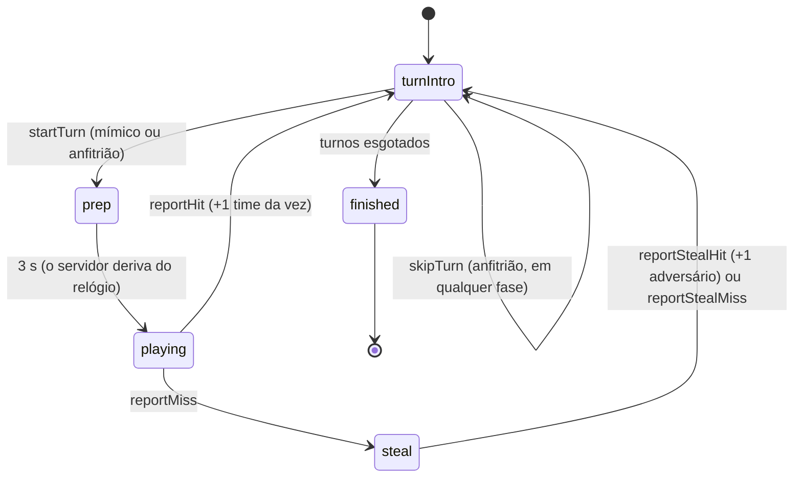

# Jogo: Mímica

Módulo `RonatIa.Games.Mimica` (id `mimica`). É o jogo do app original "Mímica Brasileira", com as mesmas regras e as mesmas 640 cartas, agora com as **regras no servidor**: a carta é sorteada aqui e só o mímico a vê. Este documento é o guia para quem faz o cliente (Web e Android); o contrato HTTP geral está em [`../API.md`](../API.md) e como um jogo é construído, em [`../GAME_DEVELOPMENT.md`](../GAME_DEVELOPMENT.md).

## Como se joga

Dois times se alternam. Na vez de um time, **um jogador (o "mímico", em rodízio)** vê uma carta e faz a mímica; o time dele tenta adivinhar. O mímico dá o veredito:

- **Acertou** (`reportHit`): 1 ponto para o time da vez.
- **Não acertou** (`reportMiss`): abre a **chance de roubo**: o time adversário tem 30 s para adivinhar. Se acertar (`reportStealHit`), **o adversário leva o ponto**; se não (`reportStealMiss`), ninguém pontua.

Depois de `rodadas × 2` turnos (um de cada time por rodada), vence o maior placar; **empate: todos vencem**.

## Configuração

Enviada em `config` ao criar a partida (`POST /sessions`) ou em `PATCH /sessions/{id}/config` (só no lobby). O que faltar assume o padrão; o servidor devolve a configuração **normalizada** em `session.config`.

| Campo | Padrão | Faixa | Descrição |
|---|---|---|---|
| `rounds` | 10 | 1 a 30 | rodadas por time (o app oferecia 10, 20 e 30); a partida tem `rounds × 2` turnos |
| `turnSeconds` | 60 | 10 a 300 | duração da mímica, depois dos 3 s de preparo (o app oferecia 30, 60 e 120) |
| `categories` | todos | pelo menos um, sem repetir | temas ativos: `expressoes`, `famosos`, `cotidiano` |
| `lateGraceSeconds` | 3 | 0 a 10 | tolerância para registrar um acerto logo depois de o tempo acabar (latência do celular) |

Constantes do jogo: preparo de **3 s** e chance de roubo de **30 s** (vêm na `view` como `prepSeconds` e `stealSeconds`).

Limites: 2 a 24 jogadores, **2 times** com pelo menos 1 jogador cada. O lobby (entrar, perfis sem conta, times) é o da plataforma.

## Quem faz a mímica

O mímico da vez é `roster[time][⌊turno / 2⌋ mod tamanho]`, em que o `roster` de cada time segue a ordem de entrada no lobby, o turno par é do time 0 e o ímpar, do time 1 (idêntico ao app original). A `view` traz `performerPlayerId`.

Quem dá os comandos da vez é **o mímico ou o anfitrião** (anfitrião da partida ou administrador do grupo). O anfitrião cobre o jogador **sem conta** (que não tem celular), a desconexão e o "um celular na mesa". Mais ninguém: nem o colega de time, nem o adversário, nem quem assiste.

## Fases



| Fase (`view.phase`) | Significado | Quem age |
|---|---|---|
| `turnIntro` | "é a vez do time X; quem faz a mímica é Y" | o mímico (ou o anfitrião) toca em "Ver minha mímica": `startTurn` |
| `prep` | contagem de 3 s com a carta já visível ao mímico; sem veredito | ninguém |
| `playing` | cronômetro rodando; o mímico confere | o mímico/anfitrião: `reportHit` ou `reportMiss` |
| `steal` | chance de roubo de 30 s para o adversário | o mímico/anfitrião: `reportStealHit` ou `reportStealMiss` |
| `finished` | acabou: `session.status` vira `finished` e `session.standings` traz o resultado | |

**O tempo é do servidor.** O cliente só mostra o cronômetro a partir dos prazos da `view` (`prepEndsAt`, `playEndsAt`, `stealEndsAt`) e `session.deadlineAt`, corrigindo a diferença de relógio com `GET /api/v1/meta` (`serverTimeUtc`). Zerar o cronômetro **não encerra o turno** (como no app original): o mímico ainda pode registrar `reportMiss`; `reportHit` é aceito até o prazo **mais** `lateGraceSeconds` (depois, `409 mimica.turn_expired`) e o `reportStealHit`, até o fim da chance de roubo mais a tolerância (`409 mimica.steal_expired`). Se ninguém agir, o turno fica parado até o anfitrião usar `skipTurn`.

## Ações (`POST /sessions/{id}/actions`)

Corpo: `{ "clientActionId": "<uuid>", "type": "...", "payload": {} }`. Nenhuma ação da Mímica precisa de `payload`. O servidor responde com a partida na visão de quem enviou.

| `type` | Quem | Quando | Efeito |
|---|---|---|---|
| `startTurn` | mímico, anfitrião | `turnIntro` | começa o preparo de 3 s |
| `reportHit` | mímico, anfitrião | `playing` (até o prazo + tolerância) | +1 ao time da vez; próximo turno |
| `reportMiss` | mímico, anfitrião | `playing` (a qualquer momento) | abre a chance de roubo |
| `reportStealHit` | mímico, anfitrião | `steal` (até o fim + tolerância) | +1 ao **adversário**; próximo turno |
| `reportStealMiss` | mímico, anfitrião | `steal` | ninguém pontua; próximo turno |
| `skipTurn` | **só o anfitrião** | qualquer fase não terminada | pula o turno sem pontos (mímico ausente, desconexão) |

Recusas (todas com `code` estável): `403 mimica.not_performer` (não é o mímico nem o anfitrião), `403 mimica.host_only` (`skipTurn` por quem não é anfitrião), `409 mimica.turn_already_started`, `409 mimica.not_playing`, `409 mimica.not_stealing`, `409 mimica.turn_expired`, `409 mimica.steal_expired`, `409 mimica.finished`, `400 mimica.unknown_action`. A lista `allowedActions` da `view` já diz o que mostrar: **o cliente não precisa deduzir** (o botão "Acertou!" some sozinho depois do prazo, "Não acertou" fica).

## A visão (`session.view`)

Montada **por quem consulta**. A `view` pública (todos) traz:

```json
{
  "phase": "playing",
  "round": 3, "totalRounds": 10, "turn": 4, "totalTurns": 20,
  "team": 0, "performerPlayerId": "…",
  "turnSeconds": 60, "prepSeconds": 3, "stealSeconds": 30,
  "prepEndsAt": null, "playEndsAt": "2026-10-05T20:15:30Z", "stealEndsAt": null,
  "scores": { "0": 3, "1": 2 },
  "card": null,
  "lastTurn": { "turn": 3, "team": 1, "performerPlayerId": "…", "outcome": "stealHit",
                "card": { "categoryId": "famosos", "kicker": "Famoso ou personagem:", "text": "Pelé", "promptId": "fam-001" } }
}
```

- `card` é `null` para todos, **exceto** o mímico, durante `prep`, `playing` e `steal`: `{ categoryId, kicker, text, promptId }` (o `kicker` é o rótulo do tema, ex.: "Famoso ou personagem:"). **O anfitrião também vê a carta quando o mímico é um perfil sem conta**, para dar o veredito por ele; nos demais casos, não.
- `lastTurn` é o **resumo do turno anterior, aberto a todos**: o desfecho (`hit`, `stealHit`, `stealMiss`, `skipped`) e a carta revelada ("A mímica era…").
- `scores` é por time. Os pontos individuais não existem na Mímica: o livro-razão da partida registra pontos por **time**.
- Em `finished`, `team` e `performerPlayerId` vêm `null` e `session.standings` traz a classificação (posição por time: 1 e 2, ou 1 e 1 no empate).

## Eventos (`GET /sessions/{id}/events`)

Só fatos públicos, **ids e nunca o texto da carta**: `mimica.turn_ready` (`turn`, `round`, `team`, `performerPlayerId`), `mimica.turn_started`, `mimica.miss`, `mimica.turn_ended` (`outcome`, `categoryId`, `promptId`) e `mimica.finished` (`scores`), além de `session.started`, `action.<tipo>` e `session.finished` da plataforma.

## Conteúdo

As **640 cartas** do app original (339 expressões populares, 146 famosos e personagens, 155 situações do dia a dia) vivem em `src/Games/RonatIa.Games.Mimica/Content/prompts.pt-BR.json`, sem repetições (verificado por teste, ignorando acentos e maiúsculas). Cada carta tem um **id estável** (`exp-001`, `fam-001`, `cot-001`): o estado da partida guarda ids, não textos. Para acrescentar cartas, **acrescente ao fim do tema com um id novo**; nunca reaproveite nem renumere ids. Novos temas entram como mais uma `category` no JSON (e passam a valer em `categories`).

**Baralho:** o tema da vez é sorteado por igual entre os ativos e a carta, entre as ainda não usadas daquele tema. Não repete até esgotar o tema; esgotado, recomeça sem repetir a última. As cartas usadas ficam no estado da partida, então **retomar não repete** (no app original isso acontecia).

## Do app original para a plataforma

| App original (um celular, offline) | Plataforma |
|---|---|
| times montados no celular | lobby da partida: `POST /sessions/{id}/players` e `PUT /teams` (ou o sorteio `POST /teams/shuffle`) |
| quem segura o celular vê a carta | só o mímico vê (cada um no seu celular); o anfitrião vê pelo perfil sem conta |
| "Acertou!" / "Fracasso!" no mesmo aparelho | `reportHit` / `reportMiss` pelo mímico (ou anfitrião) |
| cronômetro local por `Date.now()` | prazos do servidor (`playEndsAt`...) + `serverTimeUtc` para corrigir o relógio |
| baralho embaralhado no cliente | sorteio no servidor, sem expor o baralho |
| "Revanche" | `POST /sessions/{id}/rematch` |
| "Encerrar partida" | `POST /sessions/{id}/finish` (vale o placar do momento) ou `/cancel` |
